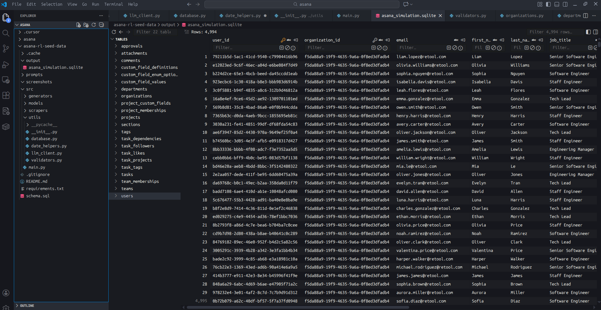

# Asana RL Seed Data Generator

This repo builds a realistic Asana-like workspace for RL evaluation. It seeds a SQLite database with organizations, departments, teams, projects, tasks, and supporting entities using real-world patterns (names from Census/SSA, project/section names from Asana templates, task patterns from public GitHub issues).

## Documentation link
https://docs.google.com/document/d/18WEUC59ssOUzjNQ7ZHBHeTrtl7gYZvFdCLCieRVSdf0/edit?usp=sharing

## What's here
- `schema.sql` — full SQLite DDL for all entities (orgs, departments, teams, projects, tasks, custom fields, tags, approvals, etc.).
- `src/main.py` — entry point; parses CLI args, applies schema, runs the methodology-based generator.
- `src/generators/` — generation logic for organizations, departments, users, teams, memberships, projects, tasks.
- `src/scrapers/` — pulls real-world distributions (Census surnames, SSA first names, YC companies, GitHub patterns, Asana templates).
- `src/models/` — dataclass models for entities.
- `src/utils/` — helpers (database, dates, validation, etc.).

## Directory details
- `requirements.txt` — Python deps to run scrapers and generators.
- `schema.sql` — full SQLite DDL (orgs, depts, teams, users, memberships, projects, sections, tasks, multi-homing, dependencies, comments, tags, custom fields, approvals, attachments, followers, likes).
- `.env.example` — override defaults (volumes, history window, output paths, seed).
- `output/` — generated SQLite lives here by default.
- `src/main.py` — CLI entry; loads env, applies schema, runs MethodologyBasedGenerator, prints summary.
- `src/scrapers/real_data_scraper.py` — loads real-world distributions (Census/SSA names, YC companies, GitHub patterns, Asana templates) with caching to `.cache/`.
- `src/generators/methodology_generator.py` — orchestrates generation order and counts; enforces temporal/relational consistency.
  - `organizations.py` — YC names, domains, creation times.
  - `departments.py` — department layer with user percentages and workflow types.
  - `users.py` — Census/SSA names, emails per org domain, titles, manager flags, activity timestamps.
  - `teams.py` — teams per department using 5–7 size heuristic and creation times.
  - `team_memberships.py` — primary team for every user, optional secondary (15%), roles weighted by manager status.
  - `projects.py` — projects per team, names from Asana templates, types, dates, creator.
  - `tasks.py` — tasks with GitHub-based titles, description mix, due/completion logic, priority, timestamps.
- `src/models/entities.py` — dataclasses for all entities (org, dept, team, user, project, task, memberships, custom fields, tags, etc.).
- `src/utils/` — database wrapper, date helpers, validation, optional LLM helper; `__init__.py` exports `Database`.
- `.cache/` — scraper caches (created at runtime).

## Screenshot
User table creation preview:


## Quick start
```bash
pip install -r requirements.txt
python src/main.py --users 5000 --organizations 1 --seed 42
```
- Output: `output/asana_simulation.sqlite` (configurable via `--output`).
- Flags: `--minimal` for a small dataset; `--verbose` for debug logs; `--tasks-per-user`, `--history-months` to tune volume/history.

## Why model departments (even though Asana doesn’t have them)
Enterprise orgs sit between “organization” and “team” with a real structural layer—departments. We include departments to:
- **Match headcount reality:** B2B SaaS companies split headcount ~40% Eng, 15% Marketing, 35% Sales/HR/CS, 10% Mgmt. Departments let us target those ratios before forming teams.
- **Drive workflow variety:** Departments map to workflow types (sprint-based, campaign-based, process-driven, oversight), which in turn shape project/task patterns, completion rates, and due-date behaviors.
- **Improve realism for agents:** Without departments, team and task distributions skew uniform and lose the organizational hierarchy that real agents must navigate.

## Methodology highlights
- **Real data seeds:** Names from Census/SSA; companies from YC; project/section templates from Asana; task title patterns from GitHub issue trackers.
- **Research-backed distributions:** Sprint lengths (Parabol 59.1% two-week), unassigned tasks (~15% Asana benchmark), optimal team size (5–7, QSM), day-of-week activity (Asana year-in-review), task completion ranges by project type.
- **Temporal & relational consistency:** Users after org creation; teams after departments; projects after teams; tasks after projects; `completed_at` always after `created_at`; membership joins after both user and team exist.
- **Reproducible:** All generators accept `random_seed` for deterministic runs.

## Template-based task generation vs. LLM APIs

### Why template-based generation?

The codebase includes `src/utils/llm_client.py` as a fallback analysis tool, but the production implementation uses **template-based generation from scraped GitHub patterns** rather than LLM API calls. Here's why:

**Cost & scale:**
- For 5,000 users × 10 tasks/user = **50,000 tasks**, LLM API calls would be prohibitively expensive
- At ~$0.25 per 1K tokens (Claude Haiku), generating 50K task names (~20 tokens each) ≈ **$250+ per run**
- Task descriptions (~100 tokens each) would add **$1,250+** more
- Total: **$1,500+ per dataset generation** — not feasible for iterative development or large-scale RL training

**Performance & reliability:**
- LLM API calls introduce latency (100-500ms per call) → **hours of generation time** vs. seconds with templates
- API rate limits and failures require retry logic and error handling
- Template-based generation is **instant, deterministic, and offline-capable**

**Quality & realism:**
- **GitHub patterns are real:** We scraped 200+ actual issue titles from React, VS Code, and Kubernetes repos
- Patterns capture authentic phrasing: `"[Bug]: API timeout when processing large payloads"`, `"Implement OAuth for Backend service"`
- Templates ensure **consistent, realistic patterns** that match real-world task naming conventions
- LLM-generated names risk inconsistency, hallucination, or patterns that don't match actual Asana usage

**The `llm_client.py` fallback:**
- Exists for **analysis and experimentation** (e.g., generating descriptions for a small sample)
- Includes template-based generators as fallback when LLM is unavailable
- Not used in production generation; kept for future extensibility if needed for specific use cases

**Current implementation:**
- Task names: Generated from GitHub patterns (`_task_name()` in `tasks.py`) with weighted random selection
- Task descriptions: Template-based with realistic distribution (20% empty, 50% brief, 30% detailed)
- Both approaches are **fast, free, reproducible, and grounded in real-world data**

## Notes
- No external keys required; scrapers use cached public datasets.
- Adjust volumes via CLI flags or env vars (`NUM_USERS`, `NUM_ORGANIZATIONS`, `TASKS_PER_USER`, `HISTORY_MONTHS`, `RANDOM_SEED`).
- The generated SQLite can be inspected directly or used as seed data for RL environments.

## How to run
- Install deps: `pip install -r requirements.txt`
- Run main: `python src/main.py --users 5000 --organizations 1 --seed 42`
- For a small smoke test: `python src/main.py --minimal`
- Optional flags: `--tasks-per-user`, `--history-months`, `--output` for DB path, `--verbose` for detailed logs.
- Output appears at `output/asana_simulation.sqlite` (or your `--output`).
